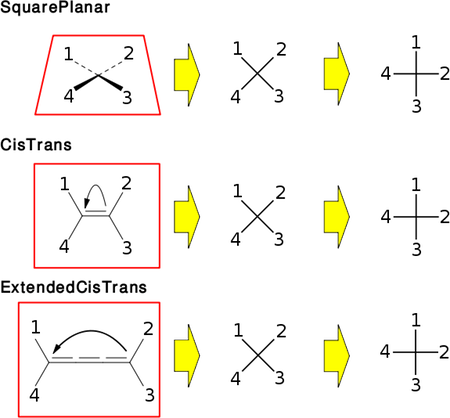
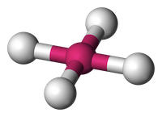
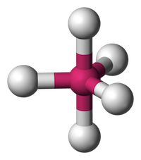

.. _reading:

Reading and Matching SMARTS
===========================

Unlike SMILES, SMARTS patterns do not have real semantics when reading them. The
semantics only come into play when the parsed SMARTS is being matched against a
molecule or it's equivalent (e.g. Markush structure). Therefore most of what is
specified in this section is concerned with the behavior of the match algorithm.
The underlying subgraph isomorphism algorithm is not relevant and is left up to
the implementers choice. The specified requirements apply to evaluating whether
a SMARTS atom or bond expression matches a queried atom or bond.

OpenSMILES
----------

This section is equivalent to section 3 in the OpenSMILES specification which
will be referenced where needed. The OpenSMILES subsections in the following
table do not apply or require slight to OpenSMARTS and should be ignored.

+---------+---------------------------------------------------------------------+
| Section | Replacement or Changes                                              |
+=========+=====================================================================+
| 3.1.2   | :ref:`totalh` and :ref:`implicith`                                  |
+---------+---------------------------------------------------------------------+
| 3.1.4   | Isotopes: There is no restriction on the position inside the        |
|         | brackets                                                            |
+---------+---------------------------------------------------------------------+
| 3.5     | Aromaticity: OpenSMARTS does not define what aromaticity is, this   |
|         | is left to the implementation aromaticity model.                    |
+---------+---------------------------------------------------------------------+
| 3.6     | Hydrogens: if there are no hydrogens specified in the SMARTS (i.e.  |
|         | total hydrogens, implicit hydrogens or explicit hydrogens) the      |
|         | match algorithm should not consider hydrogens.                      |
+---------+---------------------------------------------------------------------+

Where the OpenSMILES specification gives default values for absent information
(e.g. hydrogen count, isotope, charge, ...), these should be ignored. To match
a SMARTS, an expression tree (or it's equivalent) should be generated from the
parsed information only.

.. _inatoms:

Atoms
-----

.. _orgsbst:

Organic Subset Atoms
^^^^^^^^^^^^^^^^^^^^

The organic subset atoms are the same as the ones defined by OpenSMILES section
3.1.5. When matching these atoms only their atomic number and aromaticity should
be considered.

.. _brcktatom:

Bracketed Atoms
^^^^^^^^^^^^^^^

Atom expressions within square brackets ('[' and ']') may contain the any of
the primitives in the table below. The syntax column uses the same notations
as the previous :ref:`grammar` section. The order in which they should occur
is not specified and does not make any difference (:ref:`logicops` have to be
respected of couse).

+-------------------------+---------------------+
| Syntax                  | Section             |
+=========================+=====================+
| '*'                     | :ref:`wildcard`     |
+-------------------------+---------------------+
| 'a'                     | :ref:`aromatic`     |
+-------------------------+---------------------+
| 'A'                     | :ref:`aliphatic`    |
+-------------------------+---------------------+
| NUMBER                  | :ref:`isotope`      |
+-------------------------+---------------------+
| symbol                  | :ref:`symbol`       |
+-------------------------+---------------------+
| 'H' | 'He' | ... | 'Lr' | :ref:`symbol`       |
+-------------------------+---------------------+
| '#' NUMBER              | :ref:`atomicnumber` |
+-------------------------+---------------------+
| 'D' NUMBER?             | :ref:`degree`       |
+-------------------------+---------------------+
| 'v' NUMBER?             | :ref:`valence`      |
+-------------------------+---------------------+
| 'X' NUMBER?             | :ref:`connect`      |
+-------------------------+---------------------+
| 'H' DIGIT?              | :ref:`totalh`       |
+-------------------------+---------------------+
| 'h' DIGIT?              | :ref:`implicith`    |
+-------------------------+---------------------+
| 'R' NUMBER?             | :ref:`ringmember`   |
+-------------------------+---------------------+
| 'r' NUMBER?             | :ref:`ringsize`     |
+-------------------------+---------------------+
| 'x' NUMBER?             | :ref:`ringconn`     |
+-------------------------+---------------------+
| '-' DIGIT? | '--' \|    | :ref:`charge`       |
| '+' DIGIT? | '++'       |                     |
+-------------------------+---------------------+
| '@' '?'? | '@@' '?'? \| | :ref:`chiral`       |
|   | '\@TH1''?'? \|      |                     |
| ... | '\@OH30' '?'?     |                     |
+-------------------------+---------------------+
| ':' NUMBER              | :ref:`class`        |
+-------------------------+---------------------+

The semantics of each atom primitive will be discussed below. Types for all of
the primitives are suggested but these are not stricly required to be OpenSMARTS
compliant and are only provided to aid implementers.

.. _wildcard:

Wildcard
""""""""

The '*' wildcard atom primitive matches any atom. The suggested type is **True**.
Although most implementations do not have a need for the opposite, it can be
expressed using '!*' (**False**).

.. _aromatic:

Aromatic
""""""""

The 'a' aromatic atom primitive matches any aromatic atom. The meaning of
aromaticity is to the implementation's aromaticity model. Suggested type
**Aromatic**.

.. _aliphatic:

Aliphatic
"""""""""

The 'A' aliphatic atom primitive matches any aliphatic atom. The meaning of
aromaticity is to the implementation's aromaticity model. Suggested type
**Aliphatic**.

.. _isotope:

Isotope
"""""""

The isotope atom primitive specifies the isotope. All positive integers are
allowed values although high values will not match any atoms. Isotope 0 does
not mean any isotope (see OpenSMILES section 3.1.4). Since this primitive
does not have a prefix, there is no default value. Suggested type **Isotope**.

.. _symbol:

Symbol
""""""

The symbol atom primitive includes the 111 element symbols as defined by for
OpenSMILES and the OpenSMARTS grammar including the lower case aromatic symbols.
There is no single suggested type, instead a combination of **Aromatic** and
**AtomicNumber** is recommended.

See :ref:`totalH` for detail about explicit hydrogens.

.. _atomicnumber:

Atomic Number
"""""""""""""

The '#' atomic number atom primitive specifies the atomic number for the atom.
Both aliphatic and aromatic atoms should match. There is no default value
allowed by the syntax. Suggested type **AtomicNumber**.

.. _degree:

Degree
""""""

The 'D' atom primitive specifies the atom's degree. This is the number of explicit
bonds an atom has in the molecular graph. The default value when no number is present
is 1 and matches all atoms with exactly 1 bond. Suggested type **Degree**.

.. _valence:

Valence
"""""""

The 'v' atom primitive specifies the atom valence. This is the sum of the bond orders
of the explicit bonds in the molecule. The default value in the absence of a number is
1 which matches all atoms with a total bond order sum of 1. Suggested type **Valence**.

.. _connect:

Connectivity
""""""""""""

The 'X' atom primitive specifies the connectivity of an atom. This is the number of
bonds an atom has including the bonds to any implicit hydrogens there may be. The default
value is a connectivity of 1 which matches all atoms with a single bond or atoms without
any bonds that have an implicit hydrogen (e.g. charge neutral Cl atom). Suggested type
**Connectivity**.

.. _totalh:

Total Hydrogen Count
""""""""""""""""""""

The 'H' atom primitive specifies the total number of hydrogens for an atom. This is
the sum of the attached explicit hydrogens and the implicit hydrogens. The default
value is 1 which matches all atoms that have exactly 1 explicit hydrogen attached or
have exactly 1 implicit hydrogen. The suggested type is **TotalHydrogenCount**

Explicit hydrogens are also represented using 'H'. Only **Isotope**, **Degree**,
**Valence**, **RingMembership**, **RingSize**, **RingConnectivity** and **Charge**
can be combined with an explicit hydrogen using an **AndHigh** or **AndLow** logical
operator. An explicit hydrogen without other primitives is written as '[H]'.

**Question:** *The syntax for explicit hydrogens combined with other primitives is
not clear. For example, the SMARTS [H+] could mean a hydrogen atom with a possitive
charge or any atom with a possitive charge and exactly 1 explicit hydrogen attached.*

.. _implicith:

Implicit Hydrogen Count
"""""""""""""""""""""""

The 'h' atom primitive specifies the number of implicit hydrogens for an atom. The
default is 1 and matches all atoms with **at least** 1 implicit hydrogen. Suggested type
**ImplicitHydrogenCount**.

Since molecules from a source may contain no hydrogens (i.e. all implicit), all explicit
hydrogens or a combination, the use of the implicit hydrogen count is not recommended
for general applications. However, this could be a useful feature for a toolkit that
wants to normalize hydrogens to a uniform model. For other applications, the total
hydrogen count should be used.

Another problem with implicit hydrogens is that the resulting matches may not be
the same as what an end user, not familiar with how implicit/explicit hydrogens
are handled in cheminformatics toolkits expects. The use of explicit hydrogens
is therefore discouraged. The use of explicit hydrogens is undefined and
implementation dependant.

+-------------------------------------------------------+-----------------------------------------------+
| SMARTS                                                | Acceptable Matching SMILES                    |
+=======================================================+===============================================+
| [#1], [H]                                             | (1) Toolkit uses the hydrogens from the input |
|                                                       | without modification: [H] (not C, N, ...)     |
|                                                       +-----------------------------------------------+
|                                                       | (2) Toolkit makes all hydrogens explicit in   |
|                                                       | the queried molecule: [H], [\*H], [\*H2],     |
|                                                       | [\*CH3] or [\*H4]                             |
|                                                       +-----------------------------------------------+
|                                                       | (3) Toolkit makes all hydrogens implicit in   |
|                                                       | the queried molecule: none                    |
|                                                       |                                               |
|                                                       | ('hiding' all hydrogens is often done by an   |
|                                                       | implementation to improve performance of the  | 
|                                                       | subgraph isomorphism algorithm)               |
+-------------------------------------------------------+-----------------------------------------------+
| \*[!O]                                                | Although this SMARTS does not have an         |
|                                                       | explicit hydrogen, the handling of hydrogens  |
|                                                       | effects the possible matches.                 |
|                                                       +-----------------------------------------------+
|                                                       | Toolkits using (1) will match OC[H] and CN    |
|                                                       | but not CO.                                   |
|                                                       +-----------------------------------------------+
|                                                       | Toolkits using (2) will match OC[H], CN and   |
|                                                       | CO.                                           |
|                                                       +-----------------------------------------------+
|                                                       | Toolkits using (3) will match CN but not      |
|                                                       | OC[H] or CO                                   |
+-------------------------------------------------------+-----------------------------------------------+

In any case, the implementation should ideally document it's behavior and allow
a choice between the 3 methods.

.. _ringmember:

Ring Membership Count
"""""""""""""""""""""

The 'R' atom primitive specifies the ring membership count. This is the number of rings
that the atom is part of. The default in the absence of a number has special semantics,
namely it matches any ring atom regardless of the number of rings it is part of. For this
reason, the default is give a separate type here **Cyclic**. Similarly, 'R0' matches all
atoms that are acyclic (i.e. not part of any ring) and is assigned the **Acyclic** type.
The suggested type for other values is **RingMembership**

For other values, the requirements for determining if there is a match depends on the
ring set that is used. Originally, Daylight used the widely Smallest Set of Smallest
Rings (SSSR) which is a minimum cycle basis. However, the relevant cycles (also known
as K-rings) [`Vismara <http://www.opensmarts.org/references.html#vismara>`_] are 
more intuitive to the authors opinion. Therefore,
OpenSMARTS does not specify this but recommends that the SSSR should be used by default.
Other ring sets (K-rings, all cycles, simple cyles, ...) can then be used in the case
a user explicitly asks for this.

**Question**: What ring set should be default/required, if any?

.. _ringsize:

Ring Size
"""""""""

The 'r' atom primitive specifies the size of a any ring that the atom should be member of.
The default value is 1 and has the same semantics as the default value for ring membership
count (i.e. **Cyclic**). Unlike all other atom primitives, the ring size primitive is not
a unique atom property (see :ref:`unique`). An atom can be part of multiple rings with
different sizes. This allows for ring size primitives to be combined using a logical AND.
Since there are no rings smaller than 3 atoms (parallel and self-loop edges are not
allowed in a molecular graph), the minimum legal value is 3. The suggested type is
**RingSize**.

.. _ringconn:

Ring Connectivity
"""""""""""""""""

The 'x' atom primitive specifies the number of ring bonds an atom has. The default is
to match any atom with **at least** 1 ring bond. The value 0 is, again, the same as
**Acyclic**. The value 1 should be interpreted in the same way as the default since,
by definition (a cycle is a graph where every vertex has degree 2), a cyclic atom
always has at least 2 ring bonds. Suggested type **RingConnectivity**.

.. _charge:

Charge
""""""

The '-', '--', '+' and '++' atom primitives specify the formal charge. The default values
are -1 and +1 respectively. Charge is is the only primitive that can have negative values.
The suggested type is **Charge**.

**Deprecated:** *The '--' and '++' syntax is deprecated but should still be accepted.*

.. _chiral:

Chirality
"""""""""

The '@', '@@', '\@TH1', ..., '\@OH29', '\@OH30' atom primitives specify the atom chirality.
The semantics of chirality can be found in the :ref:`chirality` section below. The suggested
type is **Chirality**.

.. _class:

Atom Class
""""""""""

The ':' atom primitive specifies the atom class. This is a label for an atom expression
and has no meaning when matching atoms. The use of these labels is implementation and
application dependent (e.g. reaction SMARTS). There is no default value and labels are
integers starting from 1. Suggested type **AtomClass**.

.. _inbonds:

Bonds
-----

Bond expression may contain any of the bond primitives from the table below. 

+-------------------------+---------------------+-----------------------+
| Syntax                  | Semantics           | Suggested type        |
+=========================+=====================+=======================+
| '-'                     | Single Bond         | **Single**            |
+-------------------------+---------------------+-----------------------+
| '='                     | Double Bond         | **Double**            |
+-------------------------+---------------------+-----------------------+
| '#'                     | Triple Bond         | **Triple**            |
+-------------------------+---------------------+-----------------------+
| '$'                     | Quadruple           | **Quadruple**         |
+-------------------------+---------------------+-----------------------+
| ':'                     | Aromatic Bond       | **Aromatic**          |
+-------------------------+---------------------+-----------------------+
| '~'                     | Any Bond            | **Any**, **True**     |
+-------------------------+---------------------+-----------------------+
| '@'                     | Ring Bond           | **Ring**              |
+-------------------------+---------------------+-----------------------+
| '/'                     | Up Bond             | **UpBond**            |
+-------------------------+---------------------+-----------------------+
| '\\'                    | Down Bond           | **DownBond**          |
+-------------------------+---------------------+-----------------------+
| '/?'                    | Up Bond             | **UpDownBond**        |
+-------------------------+---------------------+-----------------------+
| '\\?'                   | Down Bond           | **UpDownBond**        |
+-------------------------+---------------------+-----------------------+

The same rules from OpenSMILES apply for implicit bonds.

.. _logicops:

Logical Operators
-----------------

Both atom and bond expressions may contain the unary and binary logical
operators from the table below.

+-------------------------+-------------------------+-----------------------+------------+
| Syntax                  | Semantics               | Suggested type        | Precedence |
+=========================+=========================+=======================+============+
| '!' expr                | Not, Negation           | **Not**               | 1          |
+-------------------------+-------------------------+-----------------------+------------+
| expr '&' expr           | And (High Precedence)   | **AndHigh**           | 2          |
+-------------------------+-------------------------+-----------------------+------------+
| expr ',' expr           | Or                      | **Or**                | 3          |
+-------------------------+-------------------------+-----------------------+------------+
| expr ';' expr           | And (Low Precedence)    | **AndLow**            | 4          |
+-------------------------+-------------------------+-----------------------+------------+

For atoms, these operators may only be used within the square brackets '[' and
']'. When two expressions are not separated by any of the operators, an implicit
high precedence **AndHigh** sould be inserted between them.

Precedence
^^^^^^^^^^

There are 2 types of ANDs with different precedence to allow a SMARTS to only
match when two OR-ed expressions evaluate to true. For example, the SMARTS
[N,O;+,-] will match a positively charged nitrogen, negatively charge oxygen
both neither charge neutral nitrogen or oxygen. The SMARTS will not match any
other elements regardless of their charge.

+-------------------------------------------------------+-----------------------------------------------+
| SMARTS                                                | Matches                                       |
+=======================================================+===============================================+
| [CH3]                                                 | Aliphatic carbon with 3 hydrogens (methyl)    |
+-------------------------------------------------------+-----------------------------------------------+
| [C&H3]                                                | Same, with explicit high precedence and       |
+-------------------------------------------------------+-----------------------------------------------+
| [C;H3]                                                | Same, with low precedence and                 |
+-------------------------------------------------------+-----------------------------------------------+
| [CH3,NH2]                                             | Methyl or primary amine                       |
+-------------------------------------------------------+-----------------------------------------------+
| [CH2,NH1;R]                                           | Carbon with 2 hydrogens or nitrogen with 1    |
|                                                       | hydrogen and the atom should be cyclic        |
+-------------------------------------------------------+-----------------------------------------------+
| \*=,#\*                                               | Any atom connected to any atom by a double or |
|                                                       | triple bond                                   |
+-------------------------------------------------------+-----------------------------------------------+
| [!#6]                                                 | Any atom that is not carbon                   |
+-------------------------------------------------------+-----------------------------------------------+
| [!B!C!N!O!P!S!F!Cl!Br!I]                              | All atoms except the aliphatic organic subset |
|                                                       | atoms                                         |
+-------------------------------------------------------+-----------------------------------------------+
| C=!@C                                                 | Any carbon atom connected to another carbon   |
|                                                       | atom by a double bond that is not in a ring   |
+-------------------------------------------------------+-----------------------------------------------+
| C=&!@C                                                | Same, with explicit and                       |
+-------------------------------------------------------+-----------------------------------------------+

Essentially, the two types of and replace the more common practise of grouping
terms using parenthesis.

+-----------------------+---------------------------------------+
| Using SMARTS Notation | Using parenthesis                     |
+=======================+=======================================+
| a&b                   | a and b                               |
+-----------------------+---------------------------------------+
| ab                    | a and b                               |
+-----------------------+---------------------------------------+
| a;b                   | a and b                               |
+-----------------------+---------------------------------------+
| a,b                   | a or b                                |
+-----------------------+---------------------------------------+
| a;b,c                 | a and (b or c)                        |
+-----------------------+---------------------------------------+
| a,b;c,d               | (a or b) and (c or d)                 |
+-----------------------+---------------------------------------+
| a&b,c;d,e             | ((a and b) or c) and (d or e)         |
+-----------------------+---------------------------------------+
| ab,cd;ef,gh           | ((a and b) or (c and d)) and          |
|                       | ((e and f) or (g and h))              |
+-----------------------+---------------------------------------+

Since there are only two types of and, the possible depth of a binary
expression tree is limited to 3.

+-----------------------+---------------------------------------+-------+
| Using SMARTS Notation | Using parenthesis                     | Depth |
+=======================+=======================================+=======+
| a                     | a                                     | 0     |
+-----------------------+---------------------------------------+-------+
| ab                    | a and b                               | 1     |
+-----------------------+---------------------------------------+-------+
| ab,c                  | (a and b) or c                        | 2     |
+-----------------------+---------------------------------------+-------+
| ab,c;d                | ((a and b) or c) and d                | 3     |
+-----------------------+---------------------------------------+-------+
| not possible          | (((a and b) or c) and d) or e)        | 4     |
+-----------------------+---------------------------------------+-------+

However, this is not a real limitation to the expressions that can be created
since expanding can be used to convert a binary expression tree to an n-ary
expression tree. This can be done algebraically or using a simple truth table
or a close inspection of the expression. Truth tables are more systematic but
double in size for each additional term.

+-------------------+-----------------------------------+-----------------------+
| Terms             | Expression                        | Truth for terms when  |
+---+---+---+---+---+-----------------------------------+ expression is True    |
| a | b | c | d | e | (((a and b) or c) and d) or e)    |                       |
+===+===+===+===+===+===================================+=======================+
| F | F | F | F | F | F                                 |                       |
+---+---+---+---+---+-----------------------------------+-----------------------+
| F | F | F | F | T | T                                 | e                     |
+---+---+---+---+---+-----------------------------------+-----------------------+
| F | F | F | T | F | F                                 |                       |
+---+---+---+---+---+-----------------------------------+-----------------------+
| F | F | F | T | T | T                                 | de                    |
+---+---+---+---+---+-----------------------------------+-----------------------+
| F | F | T | F | F | F                                 |                       |
+---+---+---+---+---+-----------------------------------+-----------------------+
| F | F | T | F | T | F                                 |                       |
+---+---+---+---+---+-----------------------------------+-----------------------+
| F | F | T | T | F | T                                 | cd                    |
+---+---+---+---+---+-----------------------------------+-----------------------+
| F | F | T | T | T | T                                 | cde                   |
+---+---+---+---+---+-----------------------------------+-----------------------+
| F | T | F | F | F | F                                 |                       |
+---+---+---+---+---+-----------------------------------+-----------------------+
| F | T | F | F | T | T                                 | be                    |
+---+---+---+---+---+-----------------------------------+-----------------------+
| F | T | F | T | F | F                                 |                       |
+---+---+---+---+---+-----------------------------------+-----------------------+
| F | T | F | T | T | T                                 | bde                   |
+---+---+---+---+---+-----------------------------------+-----------------------+
| F | T | T | F | F | F                                 |                       |
+---+---+---+---+---+-----------------------------------+-----------------------+
| F | T | T | F | T | T                                 | bce                   |
+---+---+---+---+---+-----------------------------------+-----------------------+
| F | T | T | T | F | T                                 | bcd                   |
+---+---+---+---+---+-----------------------------------+-----------------------+
| F | T | T | T | T | T                                 | bcde                  |
+---+---+---+---+---+-----------------------------------+-----------------------+
| T | F | F | F | F | F                                 |                       |
+---+---+---+---+---+-----------------------------------+-----------------------+
| T | F | F | F | T | T                                 | ae                    |
+---+---+---+---+---+-----------------------------------+-----------------------+
| T | F | F | T | F | F                                 |                       |
+---+---+---+---+---+-----------------------------------+-----------------------+
| T | F | F | T | T | T                                 | ade                   |
+---+---+---+---+---+-----------------------------------+-----------------------+
| T | F | T | F | F | F                                 |                       |
+---+---+---+---+---+-----------------------------------+-----------------------+
| T | F | T | F | T | T                                 | ace                   |
+---+---+---+---+---+-----------------------------------+-----------------------+
| T | F | T | T | F | T                                 | acd                   |
+---+---+---+---+---+-----------------------------------+-----------------------+
| T | F | T | T | T | T                                 | acde                  |
+---+---+---+---+---+-----------------------------------+-----------------------+
| T | T | F | F | F | F                                 |                       |
+---+---+---+---+---+-----------------------------------+-----------------------+
| T | T | F | F | T | T                                 | abe                   |
+---+---+---+---+---+-----------------------------------+-----------------------+
| T | T | F | T | F | T                                 | abd                   |
+---+---+---+---+---+-----------------------------------+-----------------------+
| T | T | F | T | T | T                                 | abde                  |
+---+---+---+---+---+-----------------------------------+-----------------------+
| T | T | T | F | F | F                                 |                       |
+---+---+---+---+---+-----------------------------------+-----------------------+
| T | T | T | F | T | T                                 | abce                  |
+---+---+---+---+---+-----------------------------------+-----------------------+
| T | T | T | T | F | T                                 | abcd                  |
+---+---+---+---+---+-----------------------------------+-----------------------+
| T | T | T | T | T | T                                 | abcde                 |
+---+---+---+---+---+-----------------------------------+-----------------------+

Since e is sufficient for the expression to be true, the new SMARTS should contain
the term e as one of the OR-ed terms. All remaining rows containing e maybe ignored.
The next row (ignoring de) is cd which will also be part of the new expression.
Again, the remaining rows containing cd may also be ignored. The next and final row
is abd. The resulting SMARTS is shown in the table below.

+-----------------------------+---------------------------------------+
| SMARTS Notation equivalence | Using parenthesis                     |
+=============================+=======================================+
| abd,cd,e                    | (((a and b) or c) and d) or e)        |
+-----------------------------+---------------------------------------+

.. _recursive:

Recursive SMARTS
----------------

Recursive SMARTS allow a SMARTS query to express and atom's environment.
The syntax for recursive SMARTS is given below and they may only appear
inside bracketed atoms.

+-------------------------+
| Syntax                  |
+=========================+
| '$(' chain ')'          |
+-------------------------+

The *chain* above may be any valid SMARTS. When matching recursive SMARTS, the
atoms in the recursive parts are never mapped to atoms in the queried molecule
(the implementation will internally map them to look for a match but this
mapping is not returned to the user). In effect, a bracket atom containing one
or more recursive SMARTS should be seen from a user's perspective as a sinlge
atom to be matched in specified environment. The examples below serve to clarify
this.

+-------------------------------------------------------+-----------------------------------------------+
| SMARTS                                                | Matches                                       |
+=======================================================+===============================================+
| [$([CH2][CH3])]                                       | Any atom that has a methyl group attched to   |
|                                                       | it::                                          |
|                                                       |                                               |
|                                                       |   ClCCC(CC)CCCBr                              |
|                                                       |       ^                                       |
|                                                       |   CCC(CC)CCC                                  |
|                                                       |     ^    ^                                    |
+-------------------------------------------------------+-----------------------------------------------+
| [$(aaN)$(aaa[CH3])]                                   | Any atom with a nitrogen atom in the ortho    |
|                                                       | position and a methyl group in the meta       |
|                                                       | position::                                    |
|                                                       |                                               |
|                                                       |   Cc1c(N)c(CC)ccc1                            |
|                                                       |            ^                                  |
+-------------------------------------------------------+-----------------------------------------------+
| [C$(CCO[CH3]),$(C(=O)[OH,O-])]                        | A carbon atom connected to a carboxylic acid  |
|                                                       | group or a chain of two carbon atoms with     |
|                                                       | a methoxy group on the chain's second         |
|                                                       | carbon::                                      |
|                                                       |                                               |
|                                                       |   CCCC(CCOC)C(=)O                             |
|                                                       |      ^                                        |
+-------------------------------------------------------+-----------------------------------------------+
| [$(CCCCN)$(CCO)]                                      | Recursive SMARTS may overlap when they are    |
|                                                       | matched. This results in the following SMILES |
|                                                       | to be a valid match::                         |
|                                                       |                                               |
|                                                       |   ClCC(O)CCN                                  |
|                                                       |   ^ ++ +        <- CCO                        |
|                                                       |     ++   +++    <- CCCCN                      |
+-------------------------------------------------------+-----------------------------------------------+

.. _unique:

Valued Primitives and Uniqueness
--------------------------------

Only atom primitives (not all) can have a value associated with them. Except
for the ring size 'r' atom primitive, these values are unique properties of
an atom. That is, an atom in a molecule can not have both of these values at
the same time. For example, an atom can not be cyclic and acyclic or a carbon
and nitrogen at the same time. This restricts these unique primitives to be
combined with an AND operator. All other primitives without values are also
unique. Bond order may be implemented using a value rather than 4 different
types but this doesn't change that the bond order is a unique property of a
bond. For Markush structure different semantics may apply but these are
currently not the main focus of the OpenSMARTS specification.

.. _chirality:

Chirality
---------

The chirality spcifications for tetrahedral, (extended) double bond and (extended) allene
stereochemistry is the same as those found in the OpenSMILES specification. The OpenSMARTS
supported stereochemistry can be divided into different classes based on the number and
relative orientation in 3D space of the neighbor atoms of the chiral atom.

+----------------+----------------+-----------------------------------------------------+
| Neighbor Count | Orientation    | Class                                               |
+================+================+=====================================================+
| 4              | Tetrahedral    | Tetrahedral (@TH), Allene*,** (@AL)                 |
+                +----------------+-----------------------------------------------------+
|                | Planar         | Double Bond*,** (/,\\), Square Planar (@SP)         |
+----------------+----------------+-----------------------------------------------------+
| 5              | Trigonal       | Trigonal Bipyramidal (@TB)                          |
|                | Bipyramidal    |                                                     |
+----------------+----------------+-----------------------------------------------------+
| 6              | Octahedral     | Octahedral (@OH)                                    |
+----------------+----------------+-----------------------------------------------------+
| \* The stereocenters do not have 4 neighbors on a single atom and the 4 neighbors are |
| the atoms that that originate from the point when both ends of the double bond        |
| pattern are superimposed                                                              |
| ** The stereocenters may be 'extended', that is the double bond pattern may be longer |
| then the smallest case. An even number of double bonds would then be considered an    |
| extended allene and an odd number of bonds would be considered an extended double     |
| bond.                                                                                 |
+---------------------------------------------------------------------------------------+

The image below illustrates the superpositioning of the double bond end atoms for (extended)
allenes. Note that the last example isn't actually supported by OpenSMARTS and is included
only to illustrate that this technique could also be used to handle stereogenic biphenyl
bonds.

.. image:: tetranonplanar.png

Similarly, the image below illustrates this for (extended) double bonds. 

.. _squareplanar:

Unspecified Sterochemistry
^^^^^^^^^^^^^^^^^^^^^^^^^^

Although the OpenSMILES specifications does not include unspecified stereochemistry
using the '?' syntax, it is part of OpenSMARTS. Any chiral atom primitive may be
followed by a by question mark '?'. Both '@?' and '@@?' match any stereogenic atom
in any of the defined classes. When the class is also included (e.g. '@TB?' or
'@OH17?) only stereogenic atoms of that class match. If a number is specified in
combinations with '?', the semantics do not change and all numbers for a given
class are equivalent in these cases.

Neighbor Order
^^^^^^^^^^^^^^

The following sections often refer to the order of the neighboring atom of a
stereogenic center. This order is implied by the SMARTS string itself. However,
it is not the order of how the atoms appear in the SMARTS string as many often
assume. Instead, the order in which the bonds that connect these neighboring
atoms to the stereocenter are parsed determines their order. There is only
one case where these order may not be the same and that is when using ring
closures directly after a stereogenic atom.

+-------------------------------------------------------+-----------------------------------------------+
| SMARTS                                                | Order of Neighbor Atoms                       |
+=======================================================+===============================================+
| Cl[C@]12CCCCN2CCCCO1Br                                | Order::                                       |
|                                                       |                                               |
|                                                       |   Cl[C@]12CCCCN2CCCCO1Br                      |
|                                                       |   ^       ^   ^     ^                         |
|                                                       |   1       4   2     3                         |
+-------------------------------------------------------+-----------------------------------------------+

Square Planar
^^^^^^^^^^^^^

There are three tags to represent square planar stereochemistry: @SP1, @SP2
and @SP3. Since there is no way to determine to what chirality class an atom
belongs based on the SMARTS alone, the SP class is not the default class for
tetravalent stereocenters. Therefore are the shorthand notations (@, @@) not
equivalent to @SP1 and @SP2. That is, the full specification must be there
(@SP followed by 1, 2 or 3). The square planar also differs from the other
chiral primitives in that it does not use the notion of (anti-)clockwise. 
Instead, each primitive represents a shape that is formed by drawing a line 
starting from the atom that is first in the SMARTS pattern to the next until
the end atom is reached. This may result in 3 possible shaped which are
referred to by a character with identical shape: 'U' for SP1, '4' for SP2 and
'Z' for SP3. The graphical from of these shapes is illustrated in the image 
below.

.. image:: SPshapes.png

Also note that each shape starts and ends at specific positions. Both U and Z
start from atoms that are successors or predecessors when arranging the atoms
in the plane in anti-clockwise or clockwise order. The start and end atoms for
the Z shape are never adjacent in such an ordering. For each shape there are
4 possible ways to start (and end) drawing the line. Also, for all the drawn
lines, the start and end point can be exchanged. Thus 3 shapes, 4 ways to
start/end and 2 ways to order the atoms for a shape results in 3 * 4 * 2 or
24 combinations. This is the same as the number of permutations that can be
made with 4 numbers (i.e. P(n) = n!). This allows for canonical SMILES/SMARTS
writers to use any ordering to output the atoms.

.. _trigonalbipyramidal:

Trigonal Bipyramidal
^^^^^^^^^^^^^^^^^^^^

Theoretical Background
""""""""""""""""""""""

The trigonal Bipyramidal chirality is considerably more complex than any of the
previous classes since the chiral atom has an extra neighbor. This increases the
number of combinations to order the neighbors in a SMILES/SMARTS string from 24
to 120. Since every order of the atoms should be representable by a SMARTS
string, the 20 TB primitives suffice for this. In the trigonal bipyramidal
geometry, 3 atoms lie in a plane and the remaining 2 atoms are perpendicular 
to this plane and are on the opposite sides of the plane forming an axis. The
anti-clockwise and clockwise refers to the order of the 3 pane atoms when
viewing along the axis in the specified direction. Unlike tetrahedral geometry,
reordering the 3 atoms does not require that the axis be changed. Given an order
of the axis atoms the 3 plane atoms are ordered either anti-clockwise or
clockwise. Although there are P(3) = 3! or 6 possible permutations of 3 numbers,
exchanging a pair inverts the parity and the 6 permutations are therefore
divided in two groups (@, @@) containing 3 permutations each. Because there are
now two atoms that determine the viewing direction along the axis, these atoms
too can be in any of the 5 positions in a permutation. Given the atoms
as the set {a, b, c, d, e}, there are C(5, 2) = 20 possible combinations
of 5 things taken 2 at a time. However, the use of the @ and @@ symbols halve
this to 10. These 10 combinations are the ordered sets (a, e), (a, d) (a, c),
(a, b), (b, e), (b, d), (b, c), (c, e), (c, d) and (d, e). Each of these pairs
correspond to an TB primitive.

Interpreting Trigonal Bipiramidal Stereochemistry
"""""""""""""""""""""""""""""""""""""""""""""""""

The chiral atom's neighbors are labeled a, b, c, d, and e in the order that they
are parsed. For example, for S[As@@](F)(Cl)(Br)N S corresponds to a, F to b, Cl
to c, Br to d and N to e. This order is the unit permutation, represented as the
ordered set (a, b, c, d, e). In the simplest case TB1 viewing from a towards e,
(b, c, d) are anti-clockwise (@). Likewise, TB2 is specified as viewing from a
towards e, (b, c, d) are ordered clockwise (@@). The remaining TB's permute the
axis as indicated in the table below.

+----------------+-----------+-------+----------------------------------------------------------+
| Viewing Axis   | TB Number | Order | Permutations                                             |
+------+---------+           |       |                                                          |
| From | Towards |           |       |                                                          |
+======+=========+===========+=======+==========================================================+
| a    | e       | TB1       | @     | (a, b, c, d, e), (a, b, d, c, e), (a, c, b, d, e),       |
|      |         |           |       | (a, c, d, b, e), (a, d, b, c, e), (a, d, c, b, e)        |
|      |         +-----------+-------+----------------------------------------------------------+
|      |         | TB2       | @@    | (a, c, d, b, e), (a, d, b, c, e), (a, d, c, b, e),       |
|      |         |           |       | (a, c, d, b, e), (a, d, b, c, e), (a, d, c, b, e)        |
+------+---------+-----------+-------+----------------------------------------------------------+
| a    | d       | TB3       | @     | (a, b, c, e, d), (a, b, d, e, c), (a, c, b, e, d),       |
|      |         |           |       | (a, c, d, e, b), (a, d, b, e, d), (a, d, c, e, b)        |
|      |         +-----------+-------+----------------------------------------------------------+
|      |         | TB4       | @@    | \.\.\.                                                   |
+------+---------+-----------+-------+----------------------------------------------------------+
| a    | c       | TB5       | @     | \.\.\.                                                   |
|      |         +-----------+-------+----------------------------------------------------------+
|      |         | TB6       | @@    | \.\.\.                                                   |
+------+---------+-----------+-------+----------------------------------------------------------+
| a    | b       | TB7       | @     | \.\.\.                                                   |
|      |         +-----------+-------+----------------------------------------------------------+
|      |         | TB8       | @@    | \.\.\.                                                   |
+------+---------+-----------+-------+----------------------------------------------------------+
| b    | e       | TB9       | @     | \.\.\.                                                   |
|      |         +-----------+-------+----------------------------------------------------------+
|      |         | TB11      | @@    | \.\.\.                                                   |
+------+---------+-----------+-------+----------------------------------------------------------+
| b    | d       | TB10      | @     | \.\.\.                                                   |
|      |         +-----------+-------+----------------------------------------------------------+
|      |         | TB12      | @@    | \.\.\.                                                   |
+------+---------+-----------+-------+----------------------------------------------------------+
| b    | c       | TB13      | @     | \.\.\.                                                   |
|      |         +-----------+-------+----------------------------------------------------------+
|      |         | TB14      | @@    | \.\.\.                                                   |
+------+---------+-----------+-------+----------------------------------------------------------+
| c    | e       | TB15      | @     | \.\.\.                                                   |
|      |         +-----------+-------+----------------------------------------------------------+
|      |         | TB20      | @@    | \.\.\.                                                   |
+------+---------+-----------+-------+----------------------------------------------------------+
| c    | d       | TB16      | @     | \.\.\.                                                   |
|      |         +-----------+-------+----------------------------------------------------------+
|      |         | TB19      | @@    | \.\.\.                                                   |
+------+---------+-----------+-------+----------------------------------------------------------+
| d    | e       | TB17      | @     | \.\.\.                                                   |
|      |         +-----------+-------+----------------------------------------------------------+
|      |         | TB18      | @@    | \.\.\.                                                   |
+------+---------+-----------+-------+----------------------------------------------------------+

.. _octahedral:

Octahedral
^^^^^^^^^^

.. image:: OH.png

Theoretical Background
""""""""""""""""""""""

Octahedral stereochemistry is even more complicated since there is yet another
extra neighboring atom. This raises the number of permutations to P(6) = 720.
However, the fact that the neighbors can not be partitioned in 2 or more groups
may only make it seem even more complex. However, the requirement to list for
atoms in a anti-clockwise or clockwise order always restricts the axis to a
single ordered pair (i.e. in a permutation of 6 numbers, there is only one
ordered subset of 4 numbers that are ordered increasing or decreasing). With
6 neighbors, there are C(6, 2) = 15 combinations of 6 things taken 2 at a time.

Interpreting Octahedral Sereochemistry
""""""""""""""""""""""""""""""""""""""

For 6 atoms, the unit permutation is (a, b, c ,d ,e ,f). OH1 means when viewing
from a towards f, (b, c, d, e) are ordered anti-clockwise. OH2 uses the same
axis but the 4 intermediate atoms are ordered clockwise. The table below lists
the remaining axis and orders.

+----------------+-----------+-------+
| Viewing Axis   | OH Number | Order |
+------+---------+           |       |
| From | Towards |           |       |
+======+=========+===========+=======+
| a    | f       | OH1       | @     |
|      |         +-----------+-------+
|      |         | OH2       | @@    |
+------+---------+-----------+-------+
| a    | e       | OH3       | @     |
|      |         +-----------+-------+
|      |         | OH4       | @@    |
+------+---------+-----------+-------+
| a    | d       | OH5       | @     |
|      |         +-----------+-------+
|      |         | OH6       | @@    |
+------+---------+-----------+-------+
| a    | c       | OH7       | @     |
|      |         +-----------+-------+
|      |         | OH8       | @@    |
+------+---------+-----------+-------+
| a    | b       | OH9       | @     |
|      |         +-----------+-------+
|      |         | OH10      | @@    |
+------+---------+-----------+-------+
| b    | f       | OH11      | @     |
|      |         +-----------+-------+
|      |         | OH13      | @@    |
+------+---------+-----------+-------+
| b    | e       | OH12      | @     |
|      |         +-----------+-------+
|      |         | OH14      | @@    |
+------+---------+-----------+-------+
| b    | d       | OH15      | @     |
|      |         +-----------+-------+
|      |         | OH16      | @@    |
+------+---------+-----------+-------+
| b    | c       | OH17      | @     |
|      |         +-----------+-------+
|      |         | OH18      | @@    |
+------+---------+-----------+-------+
| c    | f       | OH19      | @     |
|      |         +-----------+-------+
|      |         | OH21      | @@    |
+------+---------+-----------+-------+
| c    | e       | OH20      | @     |
|      |         +-----------+-------+
|      |         | OH22      | @@    |
+------+---------+-----------+-------+
| c    | d       | OH23      | @     |
|      |         +-----------+-------+
|      |         | OH24      | @@    |
+------+---------+-----------+-------+
| d    | f       | OH25      | @     |
|      |         +-----------+-------+
|      |         | OH30      | @@    |
+------+---------+-----------+-------+
| d    | e       | OH26      | @     |
|      |         +-----------+-------+
|      |         | OH29      | @@    |
+------+---------+-----------+-------+
| e    | f       | OH27      | @     |
|      |         +-----------+-------+
|      |         | OH28      | @@    |
+------+---------+-----------+-------+

More About TB and OH Stereochemistry
^^^^^^^^^^^^^^^^^^^^^^^^^^^^^^^^^^^^

The axis choices and TB/OH numbers may seem arbitrarily at first. However, these
numbers are assigned in the ordered that is implied by all P(n) permutations of
the neighbor atoms in lexicographical order. This even applies to the tetrahedral
case where there are only 2 designators (TH1/TH2) and serves to illustrate the
general approach.
For tetrahedral geometries, there are only 4 neighbor atoms which results in
P(4) = 24 combinations. It is a well known fact that there are only two different
configurations for these stereocenters. It is also common knowledge (for chemists)
that exchanging any pair inverts the stereochemistry. In mathematically terms,
exchanging two adjacent elements in a permutation inverts the parity. This is exactly
what happens when the next lexicographical permutation is generated. Staring from
the unit permutation which is assigned TH1, the next permutation is generated which
inverts the parity and is therefore assigned TH2. The 3th permutation inverts the
parity again and is assign TH1.

Listing first few permutations::

  Permutation           Order   TH?

  (a, b, c, d)          @       TH1 
  (a, b, d, c)          @@      TH2
  (a, c, b, d)          @       TH1
  (a, c, d, b)          @@      TH2
  (a, d, b, c)          @       TH1
  (a, d, c, b)          @@      TH2
  (b, a, c, d)          @       TH1
  (b, a, d, c)          @@      TH2
  ...

For TB and OH stereochemistry, there is one exception. TB1/TB2 and OH3/OH3 are always
assigned to permutation 1 and 3 respectively. This is to make the default classes
@ (TB1/OH1) and @@ (TB2/OH2) simple to interpret for humans. For TB1 and OH1, the
viewing axis should be looked along starting from the first atom (a) towards the
last atom (e or f) and the 3 or 4 intermediate atoms are ordered anti-clockwise
(@). The axis applies for TB2 and OH2 but the intermediate atoms are ordered
clockwise (@@). The remaining numbers are designated sequentially starting from
3.

First few permutations for Trigonal Bipyramidal::

  Permutation             View Axis     Order   TB?   
                        From  Towards

  (a, b, c, d, e)       a     e         @       TB1
  (a, b, c, e, d)       a     d         @       TB3
  (a, b, d, c, e)       a     e         @@      TB2
  (a, b, d, e, c)       a     d         @@      TB4
  (a, b, e, c, d)       a     c         @       TB5
  (a, b, e, d, c)       a     c         @@      TB6
  ...

First few permutations for Octahedral::

  Permutation             View Axis     Order   OH?   
                        From  Towards

  (a, b, c, d, e, f)    a     f         @       OH1
  (a, b, c, d, f, e)    a     e         @       OH3
  (a, b, c, e, d, f)    a     f         @@      OH2
  (a, b, c, e, f, d)    a     e         @@      OH4
  (a, b, c, f, d, e)    a     d         @       OH5
  (a, b, c, f, e, d)    a     d         @@      OH6
  ...

.. _reading_programming:

Programming Practises
---------------------

The same practises as for the OpenSMILES specification (section 3.11) apply. Furthermore,
the NUMBER expressions for atom primitives should at least support values in the range 0
to 999. An exception is the atom class which should at least support values between 1 and
9999.

.. _reading_implementation:

Implementation
^^^^^^^^^^^^^^

This section should not be considered to be part of the actual specification and is provided
to aid implementers only.

The easiest data structure to implement an expression tree is to use a binary tree. There
isn't any requirement on how the matching is actually done though. Another option is to
use an n-ary tree or not use any tree structure at all (e.g. converting the SMARTS to code).

A full OpenSMARTS stack consists of a parser, a subgraph isomorphism algorithm, a chemical
backend and writer. A writer is not required for may applications and most implementations
don't include it. Most implementations combine the 3 first parts of the stack into a single
piece of code. However, modularity is recommended and implementing these parts separately
is highly recommended. Since an OpenSMILES parser is very similar to an OpenSMILES parser,
it is also recommended to combine these to improve code reuse and benefit from bug fixes in
the shared code.

